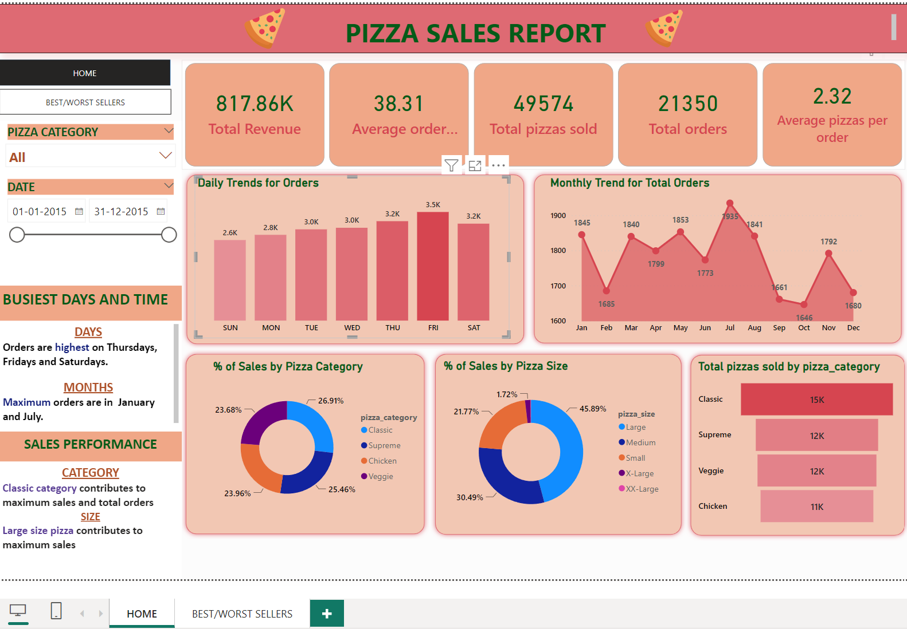

# Pizza-Sales-Analysis using MS SQL SERVER and POWER BI

## Project Overview
The Pizza Sales data in Excel is being analysed in MS SQL SERVER to get the Data values for analysis .Data ia also cleaned ,transformed and analysed using Power Query and also various measures are created to calculate various KPI's in Pizza Sales Data.
Finally ,the KPI's and other related data are visualized using PowerBI Dashboard.

## Data Sources
The primary dataset used in the analysis is "Pizza_Sales_Data.csv" file containing all the information about the pizza sales done for the year 2015.The data has more than 40000 rows and columns having information about pizza sales,orders,type,etc.

## Tools
- Excel (Dataset)
- MS SQL SERVER (Querying for Data Values)
- SQL SERVER MANAGEMENT STUDIO
- PowerBI (Data cleaning,Analysis and Visualisation)
  
## Steps followed in this project.
  1. In the initial phase of data preparation ,data is loaded into SQL SERVER MANAGEMENT STUDIO and using SQL Queries various parameters are calculated.
  2. All the queries used for calculations are documented along with the output result.
  3. Once the all the required values are calculated,the dataset in SQL SERVER is loaded into POWER BI.
  4. Data Cleaning and Transformation done in PowerBI.
  5. Again all the calculations such as KPI's and various parameters for data analysis are carried out using DAX functions in POWERBI.
  6. The results are compared with results obtained using Data Analysis done in SQL.Both results are found to be same.This helps us to check the accuracy of the calculations done.

## Exploratory Data Analysis (EDA)

EDA involves exploring the pizza sales data to find KPI's such as Total Revenue,Average Order Value,Total Pizzas Sold,Total Orders,Average Pizzas per Order.

## Data Analysis
Data is analysed on different parameters such as Daily and Monthly Trend for Orders,Percentage of Sales by Pizza size and Category,Top 5 and Bottom 5 Pizzas by Revenue,Top 5 and Bottom 5 Pizzas by Orders,Top 5 and Bottom 5 Pizzas by Quantity.

## Summary of Findings
###  The analysis is summarized as follows

1. KPI's for the Pizza Sales is calculated.
2. Orders are high on Fridays and Saturdays.
3. Maximum orders are in  January and July.
4. Classic category contributes to maximum sales and total orders.
5. Large size pizza contributes to maximum sales.
6. The Thai Chicken Pizza contributes to maximum Revenue.
7. The Classic Deluxe Pizza contributes to maximum Quantity and highest number of orders.
8. The Brie Carre pizza contributes to minimum Revenue and minimum quantity and minimum orders.

## Recommendations
1. Based on the analysis,it is found that The Brie Carre pizza has contributed towards the minimum revenue,sales and orders.A detailed analysis like getting feedback from customers to know why they dont like it and asking chefs the reason for low order may help bring some changes in orders and revenue.
2. As there are more number of orders on weekends ,more chefs must be employed to serve better and quick.

## Limitations
As the previous years data is not available KPI performance cannot be compared.

